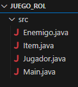

# RolGameJavaUnit5

## Introduction  
**RolCombat** is a simple RPG game where the player controls a character that must fight enemies to progress and gain experience. The game is developed in Java and written in Spanish, using the console as the user interface.

---

## 📖 Instructions for Use  
1. Open the project in your preferred IDE (I use VS Code).  
2. Run the `Main` class to start the game.  
3. Follow the instructions displayed on the console to interact with the game.  

---

## 🛠️ Classes Used  
- **`Main`**: The main class that runs the game.  
- **`Jugador` (Player)**: Represents the player and contains methods for managing their inventory and stats.  
- **`Enemigo` (Enemy)**: Represents the different enemies the player must fight.  
- **`Item`**: Class that defines the items the player can equip in their inventory.  



---

## 🎒 Available Items  
1. **Sword**:  
   - Description: A sword that provides medium damage in combat.  
   - Dodge Rate: Low  

2. **Axe**:  
   - Description: A powerful weapon that deals high damage in combat.  
   - Dodge Rate: Medium  

3. **Dagger**:  
   - Description: A swift dagger that deals quick damage.  
   - Dodge Rate: High  

---

## ⚔️ Enemies  
The game features different types of enemies, each with unique abilities and characteristics.

---

## 💻 Main Code  
```java
import java.util.Random;
import java.util.Scanner;

public class Main {
    final static Scanner scanner = new Scanner(System.in);
    final static Random random = new Random();
    final static Jugador primerJugador = new Jugador("", "an invincible character that "
            + "can eliminate any enemy in one shot", 10, 20);

    final static Item sword = new Item("sword", "a strong weapon for combat");
    final static Item axe = new Item("axe", "great for chopping wood and heads");
    final static Item dagger = new Item("dagger", "perfect for quick stabs");

    final static Enemigo firstEnemy = new Enemigo("pepe", 25, random.nextInt(6) + 1);

    public static void main(String[] args) {
        System.out.println("What is your name?");
        String name = scanner.next();
        primerJugador.addNombre(name);

        primerJugador.addItemAlInventario(sword, 0);
        primerJugador.addItemAlInventario(axe, 1);
        primerJugador.addItemAlInventario(dagger, 2);

        boolean continueGame = true;
        String action = "";
        while (continueGame) {
            System.out.println("What do you want to do now? \"Continue\" the game, \"Equip\" an item, or \"End\" the game");
            action = scanner.next();
            switch (action.toLowerCase()) {
                case "continue":
                    continueGame();
                    break;

                case "equip":
                    System.out.println("Which weapon do you want to equip?");
                    primerJugador.listarInventario();

                    String selectedItem = scanner.next();
                    for (int i = 0; i < primerJugador.getInventario().length; i++) {
                        if (primerJugador.getInventario()[i] != null) {
                            if (selectedItem.equals(primerJugador.getInventario()[i].getName())) {
                                primerJugador.addItemEquipado(primerJugador.getInventario()[i]);
                            }
                        }
                    }
                    break;

                case "end":
                    System.out.println("Game over");
                    continueGame = false;
                    break;
            }
        }
    }

    public static void continueGame() {
        while (firstEnemy.getEstadoDeVida() && primerJugador.getEstadoDeVida()) {
            int enemyDamage = random.nextInt(3) + 1;
            int playerDamage = 0;

            if (primerJugador.getItemEquipado() == axe) {
                playerDamage = random.nextInt(6) + 1;
            } else if (primerJugador.getItemEquipado() == dagger) {
                playerDamage = random.nextInt(2) + 1;
            } else if (primerJugador.getItemEquipado() == sword) {
                playerDamage = random.nextInt(4) + 1;
            }

            primerJugador.luchar(firstEnemy, enemyDamage, playerDamage);

            System.out.printf("The player deals %d damage to the enemy and receives %d damage in return\n",
                    playerDamage, enemyDamage);
        }
        primerJugador.getNivel();
        if (!primerJugador.getEstadoDeVida()) {
            System.out.printf("You have died. The winner is the enemy %s \n\n", firstEnemy.getName());
        } else if (!firstEnemy.getEstadoDeVida()) {
            System.out.printf("The enemy %s has been defeated. You won, %s!\n", firstEnemy.getName(),
                    primerJugador.getNombre());
        }
    }
}
